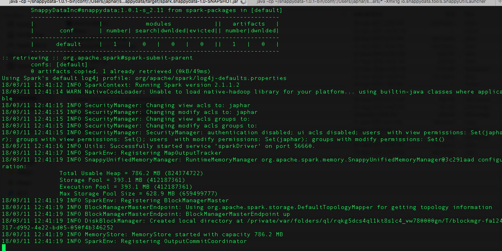
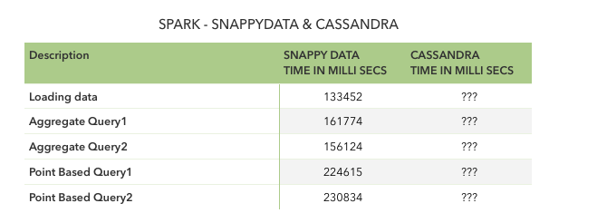

# Documentation
## Benchmark Testing - Spark SnappyData & Cassandra

Purpose of this project is to benchmark SnappyData & Cassandra with Spark.
- Run aggregration queries
- Point based queries
- Generate stats

## System Configurations
|  Operation System | Configuration |
|:------------------|:-------------|
| Mac OS     |  4 GB RAM 500 GB HD   | 

For benchmark testing, downloaded Airlines dataset which has 32+ million records (approximately 15GB) and compressed parquet files are nearly 1 GB.

### IDE: IntelliJ

<p align="center"> </br></p>

<p align="center"> </br></p>

### Snappy Data Ouput Log:

[click here](https://github.com/japhar/snappydata/blob/master/images/SnappyQueryPerfResults.log)

### Comparision Stats

<p align="center"> </br></p>

````
//SnappyData Spark-Submit command
spark-submit \
--class snappydata.benchmark.SparkSnappyDataPerf \
--master local[*] \
--conf spark.snappydata.connection=localhost:1527 \
--packages "SnappyDataInc:snappydata:1.0.1-s_2.11" \
/Users/japhar/apache/spark/snappydata/target/spark.snappydata-1.0-SNAPSHOT.jar

````

````
//Cassandra Spark-Submit command
spark-submit \
--class snappydata.benchmark.SparkCassandraPerf \
--master local[*] 
--jars /usr/local/Cellar/apache-spark/2.3.0/libexec/jars/spark-hive_2.11-2.3.0.jar \
--conf spark.cassandra.connection.host=127.0.0.1 \
--packages "datastax:spark-cassandra-connector:2.0.7-s_2.11" \
/Users/japhar/apache/spark/snappydata/target/spark.snappydata-1.0-SNAPSHOT.jar

````

### Note:

I couldn't able to generate stats for Spark Cassandra due to below error.

2018-03-12 20:18:23 INFO  DAGScheduler:54 - ResultStage 1 (take at CassandraRDD.scala:127) failed in 0.467 s due to Job aborted due to stage failure: Task 0 in stage 1.0 failed 1 times, most recent failure: Lost task 0.0 in stage 1.0 (TID 1, localhost, executor driver): java.io.IOException: Exception during preparation of SELECT "UniqueCarrier", "id", "ActualElapsedTime", "AirTime", "ArrDelay", "ArrDelaySlot", "ArrTime", "CRSArrTime", "CRSDepTime", "CRSElapsedTime", "CancellationCode", "Cancelled", "CarrierDelay", "DayOfMonth", "DayOfWeek", "DepDelay", "DepTime", "Dest", "Distance", "Diverted", "FlightNum", "LateAircraftDelay", "Month", "NASDelay", "Origin", "SecurityDelay", "TailNum", "TaxiIn", "TaxiOut", "WeatherDelay", "Year" FROM "snappy_perf_test"."airline" WHERE token("UniqueCarrier") > ? AND token("UniqueCarrier") <= ?  LIMIT 1 ALLOW FILTERING: org/apache/spark/sql/catalyst/package$ScalaReflectionLock$
	at com.datastax.spark.connector.rdd.CassandraTableScanRDD.createStatement(CassandraTableScanRDD.scala:323)
	at com.datastax.spark.connector.rdd.CassandraTableScanRDD.com$datastax$spark$connector$rdd$CassandraTableScanRDD$$fetchTokenRange(CassandraTableScanRDD.scala:339)

I've tried a lot to resolve above error but there was no luck. For a plain table (i.e. without PRIMAYKEY & CLUSTINGKEY) the code was working fine. When we working on larget dataset like 32+ million, I felt we can't go without PRIMARYKEY & CLUSTERINGKEYS.

Also, all required installtions are done on my Mac (i.e. 4 GB RAM) so that I can use SnappyData/Cassandra for further analysis.
